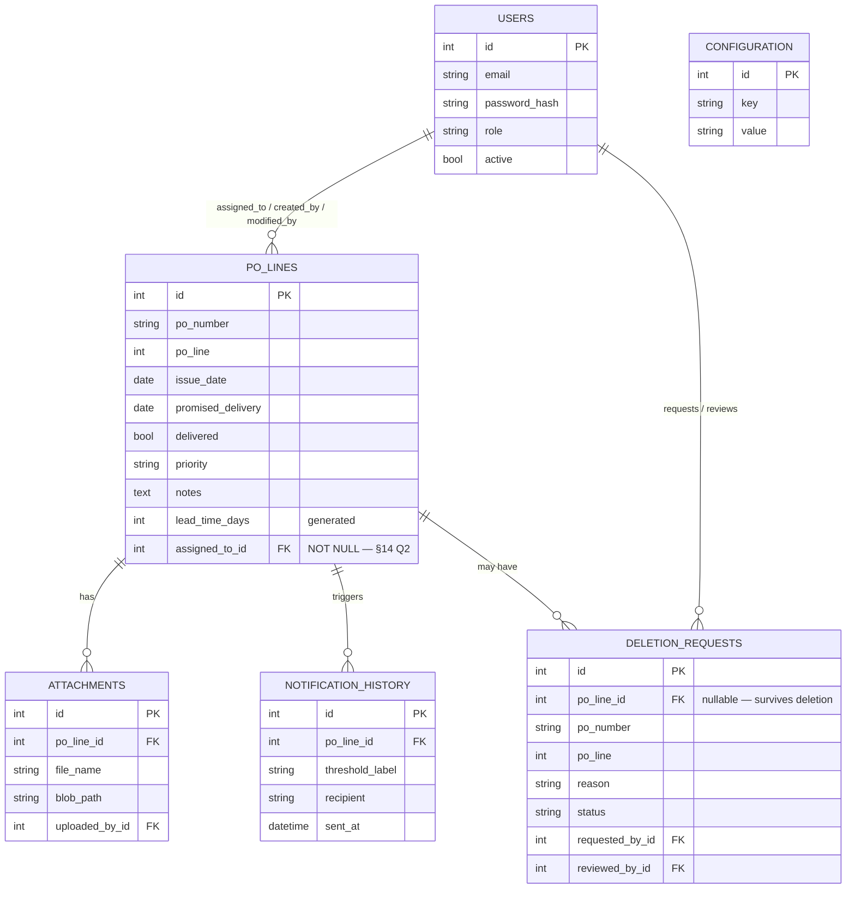

# PO Delivery Tracker — Product Requirements Document

**Version:** 2.2 — Approved
**Status:** Approved by project owner, 31 Aug 2026. Since approval: deployment target revised (§13, Azure → all-free-tier stack: Cloudflare Pages + Render + Neon + R2 + Resend); M1–M5 built and tested; M6 deployment config + runbook (`docs/DEPLOYMENT.md`) ready, provisioning is the owner's step. Private GitHub monorepo (§17) with CI on every push. Remaining: run the M6 runbook, then M7 (stretch).
**Supersedes:** the original SharePoint proposal (executive-summary Word doc), and consolidates `SRS.md` + `SYSTEM_DESIGN.md` (v0.1 drafts) with a direct audit of this repository as it stood on 31 Aug 2026.
**Repository:** https://github.com/Player-cloud/po-delivery-tracker (private) · single monorepo: `backend/`, `frontend/`, `docs/`, `.github/`. Setup steps in §17.
**Companion wireframes:** https://claude.ai/code/artifact/846dade2-b771-45bc-bbae-1904c6e02f96

> **Read this first if you're picking up implementation work (e.g. in Claude Code):** the status tags below (`[DONE]` / `[PARTIAL]` / `[GAP]` / `[PROPOSED]`) reflect the codebase as of the audit date above. Re-verify against the current tree before trusting a tag — code moves faster than docs.

---

## 1. Executive summary

PO Delivery Tracker replaces the Excel/SharePoint delivery log with a purpose-built web app. It tracks each **PO line** — not each PO — individually, because two items on the same purchase order routinely arrive on different dates. Every line's Lead Time and Days Remaining are computed automatically, and the system is meant to email the right person before a delivery is late, not after.

A working backend (FastAPI + PostgreSQL) and frontend (Next.js) already exist and have been manually tested end-to-end: login, PO line creation and editing, role-based visibility, and a deletion-approval workflow that wasn't in the original design but is a genuine improvement over it — nothing is ever silently deleted without a reason and an administrator's sign-off.

**The alerting system — the actual reason this project exists — is now built (M1, 31 Aug 2026).** A `NotificationSender` abstraction (Mailhog in dev, Resend/Brevo in prod), the daily reminder engine (`backend/app/services/reminders.py`), the de-duplication log, and a secret-guarded `POST /api/v1/internal/run-reminders` endpoint are all in place and unit + integration tested. What remains for it: an external scheduler wired up in production (GitHub Actions workflow is committed but needs a deployed backend and repo secrets — M6), and an admin UI to edit thresholds (M4).

---

## 2. Goals & non-goals

**Goals**
- Replace the Excel/SharePoint tracker with one system of record for PO line delivery status.
- Track every PO line independently — unique key is (PO Number, PO Line), not PO Number alone.
- Compute Lead Time, Days Remaining, and Status automatically; never require a manual update or a daily refresh job.
- Email the assigned person before and after a delivery is due, on thresholds an administrator can change without a code deploy.
- Give managers one dashboard that shows what needs attention today, not just a table to scroll through.
- Keep a full audit trail — who changed or deleted what, when, and why.
- Run identically in local development and in production, so deployment is a configuration change, not a rewrite. Production is a portable, all-free-tier stack (§13) — no dependency on any single cloud provider's proprietary services.

**Non-goals**
- Inventory or stock-level management.
- Vendor performance scoring or supplier scorecards.
- The procurement/ordering process itself — a PO already exists by the time it enters this system.
- Multi-currency handling or financial reconciliation.

---

## 3. Roles & personas

| Role | Can do | Visibility |
|---|---|---|
| Administrator | Everything Manager can, plus manage users/roles and alert thresholds | All PO lines |
| Manager | Create, edit, request deletion of PO lines | All PO lines |
| Staff | Create, edit, request deletion of PO lines | **Assigned lines only** |
| Viewer | Read-only | All PO lines |

**Resolved from SRS Open Question #1:** the codebase now enforces assigned-only visibility for Staff (`backend/app/crud/po_line.py`, `_visible_to`) as the shipped default. Still worth a final confirmation with the employer — see §14.

---

## 4. Build status at a glance

| Area | Status | Note |
|---|---|---|
| Authentication (JWT login) | `[DONE]` | bcrypt password hashing, working end-to-end |
| Role-based access control | `[DONE]` | Enforced server-side on every route |
| PO line create / view / edit | `[DONE]` | Tested through Swagger and the real frontend |
| PO line deletion | `[DONE]` | Via request + Administrator approval, not a direct delete — see §11 |
| Duplicate & date validation | `[DONE]` | Server-side, independent of the UI |
| Lead Time / Days Remaining / Status | `[DONE]` | Computed live — no refresh job |
| Dashboard KPI cards | `[DONE]` | 6 cards, live data |
| Dashboard "needs attention" list / chart | `[DONE]` | M2 — urgency composition bar + `GET /dashboard/attention` list, most-urgent-first |
| PO line list — filter / search / sort (UI) | `[DONE]` | M2 — status dropdown + debounced PO-number search wired to `?status=`/`?search=`. Column sort not built (list is date-ordered) |
| Colour-coded urgency (UI) | `[DONE]` | M2 — shared `StatusBadge` (colour + label) on the list and the dashboard; app pinned to light mode |
| **Email reminders** | `[DONE]` | Reminder engine, `NotificationSender` (Mailhog/Resend/Brevo), dedup log, and `POST /internal/run-reminders` — M1, tested. Production scheduler wiring is M6 |
| Configurable alert thresholds — API | `[DONE]` | `GET/PUT /config/thresholds`, Administrator-only |
| Configurable alert thresholds — admin UI | `[DONE]` | M4 — `/admin/thresholds`: add/remove day values, save to `PUT /config/thresholds` |
| File attachments | `[DONE]` | M3 — `Storage` abstraction (local disk / S3-compatible R2), upload/list/download/delete endpoints, attachments panel on the Edit screen |
| User management — API | `[DONE]` | Admin-only create/list/update |
| User management — admin UI | `[DONE]` | M4 — `/admin/users`: list, create, change role, activate/deactivate, reset password; can't lock yourself out |
| Audit trail (created/modified by + when) | `[DONE]` | Enforced at the ORM layer |
| Deletion audit trail | `[DONE]` | New since the last design pass — see §11 |
| Automated tests / CI | `[DONE]` | M5 — 83 backend tests + 8 frontend unit tests; `.github/workflows/ci.yml` runs ruff + pytest + a Postgres migration up/down + frontend typecheck/lint/test/build on every push and PR |
| Cloud deployment / infra | `[PARTIAL]` | M6 — all config in the repo (`render.yaml`, static-export frontend, `docs/DEPLOYMENT.md` runbook); not yet provisioned. Stack: Cloudflare Pages + Render + Neon + R2 (§13) |
| SSO (Microsoft Entra ID) | `[PROPOSED]` | Designed for, not started |
| Power BI reporting connection | `[PROPOSED]` | Nothing blocks it; not yet configured or tested |

---

## 5. Functional requirements

| ID | Requirement | Status |
|---|---|---|
| FR-1 | One record per PO line, uniquely keyed by (PO Number, PO Line) | `[DONE]` |
| FR-2 | Reject creation of a duplicate (PO Number, PO Line) | `[DONE]` |
| FR-3 | Store Issue Date, Promised Delivery, Delivered flag, Assigned To, Priority, Notes | `[DONE]` — Assigned To is **required** (§14 Q2): validation, `NOT NULL` (migration `0004`), required picker on both forms |
| FR-4 | Support file attachments per PO line | `[DONE]` — upload (multipart, validated), list, download, delete; blobs in `Storage` (local dev / R2 prod) |
| FR-5 | Automatically compute Lead Time (Promised Delivery − Issue Date) | `[DONE]` |
| FR-6 | Automatically compute Days Remaining and Status in real time, no scheduled refresh | `[DONE]` |
| FR-7 | Authorized users create/edit PO lines through a web form, validated client + server side | `[DONE]` |
| FR-8 | *(new)* Deleting a PO line requires a reason and Administrator approval — never a direct delete | `[DONE]` |
| FR-9 | *(new)* A deletion request's audit record survives even after the PO line itself is deleted | `[DONE]` |
| FR-10 | Send email reminders at configurable day-thresholds before the due date | `[DONE]` — engine picks the single nearest passed threshold per line per run (no burst) |
| FR-11 | Send a due-today alert, then a daily reminder while overdue | `[DONE]` — `due_today` label, then date-stamped `overdue_<date>` once per calendar day |
| FR-12 | Stop all reminders once a line is marked Delivered | `[DONE]` — delivered lines drop out of the pass's query |
| FR-13 | Log every sent reminder (line, threshold, recipient, time) so nothing sends twice | `[DONE]` — `NotificationHistory` write + per-send commit; failed sends are not logged, so they retry |
| FR-14 | Administrator can change alert thresholds without a code change | `[DONE]` — `GET/PUT /config/thresholds` + the `/admin/thresholds` screen (M4); the reminder engine reads the value live |
| FR-15 | Dashboard KPI counts: Total Open, Due Today, Due This Week, Overdue, Completed, High Priority | `[DONE]` |
| FR-16 | Dashboard surfaces the open lines needing attention, not counts alone | `[DONE]` — `GET /dashboard/attention` + a "Needs attention" table and an urgency composition bar |
| FR-17 | List view supports filtering by status and searching by PO number | `[DONE]` — status dropdown + debounced search on the PO Lines list |
| FR-18 | UI visually colour-codes lines by urgency | `[DONE]` — `StatusBadge` (overdue/today/soon/on-track/delivered), colour always paired with a label |
| FR-19 | Role-based access enforced server-side on every route | `[DONE]` |
| FR-20 | Staff see only assigned PO lines; other roles see all | `[DONE]` |
| FR-21 | Every write is attributable to a user and a timestamp | `[DONE]` |
| FR-22 | Administrator can manage users and roles | `[DONE]` — `/admin/users` (M4): create, role change, activate/deactivate, password reset; server rejects an admin removing their own access |
| FR-23 | Authenticate via JWT, with a path to Microsoft Entra ID SSO later | `[PARTIAL]` |
| FR-24 | Database reachable directly by Power BI for reporting | `[PROPOSED]` |

## 6. Non-functional requirements

| ID | Requirement | Status |
|---|---|---|
| NFR-1 | Dashboard loads under 2s with up to 5,000 open PO lines | `[PARTIAL]` — not load-tested; frontend is a static export (fast), but a cold Render backend adds ~1 min on the first request after idle. Keep-warm covers business hours (§13, §14 Q11) |
| NFR-2 | Production deployment targets 99% uptime | `[PROPOSED]` — no prod env yet; free-tier hosts sleep on idle (they wake on request, but the first hit is slow) — 99% *availability* holds, sub-2s *latency* does not without a paid always-on tier |
| NFR-3 | Secrets never committed; prod secrets held in the host's environment-variable store | `[PARTIAL]` — `.env` gitignored locally; prod secrets live in Render env vars, Cloudflare Pages env vars, and GitHub repo secrets (`render.yaml` marks them `sync: false`); no secret manager needed at this scale |
| NFR-4 | Schema normalized for future growth without redesign | `[DONE]` |
| NFR-5 | Automated tests, run in CI on every push | `[DONE]` — `ci.yml`: backend lint+tests, migration up/down on Postgres, frontend typecheck/lint/test/build |
| NFR-6 | Full app runs locally via `docker compose up`, no cloud dependency | `[DONE]` |
| NFR-7 | UI and API both validate input; never rely on UI-only checks | `[DONE]` |
| NFR-8 | Every write attributable to a user + timestamp | `[DONE]` — see FR-21 |

---

## 7. Data model

Six entities. `DeletionRequest` is new since the last design pass.



`days_remaining` and `status` are deliberately **not** stored columns — computed from `promised_delivery` against today's date (Python `hybrid_property` when a record is loaded; a SQL expression when filtering/sorting). That's what makes FR-6 true without a daily refresh job.

---

## 8. API surface

Base path `/api/v1`. Every route except `/auth/login` requires a JWT; role checks happen server-side, never trusted from the client.

| Method | Endpoint | Roles | Status |
|---|---|---|---|
| POST | `/auth/login` | — | live |
| GET | `/po-lines` | any | live |
| GET | `/po-lines/{id}` | any (own, if Staff) | live |
| POST | `/po-lines` | Staff, Manager, Admin | live |
| PUT | `/po-lines/{id}` | Staff, Manager, Admin | live |
| POST | `/po-lines/{id}/deletion-requests` | any (own, if Staff) | live |
| GET | `/deletion-requests` | Administrator | live |
| POST | `/deletion-requests/{id}/approve` | Administrator | live |
| POST | `/deletion-requests/{id}/reject` | Administrator | live |
| GET | `/dashboard/summary` | any | live — now also returns `due_soon` / `later` (a non-overlapping partition of open lines, for the urgency bar) |
| GET | `/dashboard/attention` | any (own, if Staff) | live |
| GET / PUT | `/config/thresholds` | Administrator | live |
| GET / POST / PUT | `/users` | Administrator | live — `PUT` rejects an admin demoting/deactivating themselves (400) |
| GET | `/users/assignable` | Staff, Manager, Admin | live |
| POST | `/internal/run-reminders` | none (secret `CRON_SECRET` bearer token) | live |
| GET | `/po-lines/{id}/attachments` | any (own, if Staff) | live |
| POST | `/po-lines/{id}/attachments` | Staff, Manager, Admin | live |
| GET | `/po-lines/{id}/attachments/{aid}` | any (own, if Staff) | live |
| DELETE | `/po-lines/{id}/attachments/{aid}` | Staff, Manager, Admin | live |

---

## 9. Screens & wireframes

See the companion canvas: https://claude.ai/code/artifact/846dade2-b771-45bc-bbae-1904c6e02f96

| Screen | Status | Note |
|---|---|---|
| Login | built | |
| Dashboard | built | M2 — KPI cards + urgency composition bar + "Needs attention" list |
| PO Lines list | built | M2 — status filter, debounced search, colour-coded status badges |
| New PO Line | built | now has a required Assigned To picker (§14 Q2) |
| Edit PO Line | built | required Assigned To picker (M2); attachments panel — upload / download / delete (M3) |
| Request Deletion | built | reason required |
| Admin — Deletion Requests | built | approve/reject with notes |
| Admin — Alert Thresholds | built | M4 — `/admin/thresholds`, admin-only |
| Admin — Users | built | M4 — `/admin/users`, admin-only |

---

## 10. Alert & notification system (build this first — M1)

This is the part of the original request that actually motivated the whole project. Specification:

1. **Trigger.** One protected endpoint — `POST /api/v1/internal/run-reminders` — performs a full pass when called. Nothing schedule-related runs inside the API process, so it works on a host that sleeps or scales to zero. It is invoked once a day by an *external* scheduler: a manual call or local `cron` in dev; a **GitHub Actions scheduled workflow** in production (fallback: cron-job.org). The endpoint requires a secret bearer token (`CRON_SECRET`) supplied by the caller; requests without it are rejected. The same GitHub Actions call also wakes the backend if it has scaled to zero.
2. **Scope.** Loads PO lines where `delivered = false`, oldest promised date first, capped at `REMINDER_BATCH_SIZE` (default 500). A single run must finish inside the backend host's request limit (Render's free tier times out long requests; a self-hosted process has none) and inside the email provider's daily free-tier cap, so the pass also stops after `REMINDER_MAX_EMAILS_PER_RUN` sends (default 90 — under Resend's 100/day). Anything deferred is picked up on the next daily pass.
3. **Thresholds.** Read live from `Configuration` (key `reminder_thresholds_days`, shipped default `30, 60, 90` since migration `0003`; editable via `PUT /config/thresholds`). Standing rules on top of the configured list: always send on the due date itself; while `days_remaining < 0`, send once per calendar day — to the assignee for the first `REMINDER_OVERDUE_ESCALATION_DAYS` days overdue (default 7), then to `REMINDER_ESCALATION_EMAIL` from day N+1 onward (§14 Q3).
4. **One label per line per run.** The engine computes `days_remaining` and picks the *single* most urgent label that applies: `overdue_<date>` if overdue, else `due_today` on the due date, else `<N>_day` for the **nearest already-passed** positive threshold (so a line added inside the 90-day window gets one `90_day` email, not a burst of `90_day` + `60_day` + `30_day`). `0` in the threshold list is treated as "due today" and never produces a `0_day` label.
5. **De-duplication & send.** Check `NotificationHistory` for `(po_line_id, threshold_label)`. If absent, resolve the recipient, send via the `NotificationSender`, then write the `NotificationHistory` row and commit — per send, so a mid-run crash never re-sends. A send that raises is counted as an error and **not** logged, so the next run retries it. Recipient resolution (§14 Q2, Q3): normally the line's active `assigned_to` (now a required field); once a line is more than `REMINDER_OVERDUE_ESCALATION_DAYS` days overdue, `REMINDER_ESCALATION_EMAIL` instead; `REMINDER_FALLBACK_EMAIL` as a safety net for any line still missing an assignee; if none of these resolve, log-and-skip so it retries.
6. **Stop condition.** Once `delivered = true`, the line drops out of the query in step 2 — reminders stop automatically (FR-12).

Email content: subject like *"PO ABC123 - Line 4 is due in 7 days"* (or *is due today* / *is overdue by 3 days*); body includes PO Number, Line, Issue Date, Promised Delivery, Lead Time, Days Remaining, Status, and a direct link to the record.

Dev sends through Mailhog (already wired into `docker-compose.yml`); production sends through **Resend** (3,000/mo ≈ 100/day free) or **Brevo** (300/day free) via their HTTP API, behind a `NotificationSender` interface so the reminder logic doesn't change between environments. A verified sender domain (SPF/DKIM) is required before production email will deliver reliably — see §14 Q4.

### What was built (M1, 31 Aug 2026)

| Piece | Location |
|---|---|
| Decision logic (pure, heavily unit-tested) | `backend/app/services/reminders.py` → `choose_reminder()` |
| Daily pass orchestration | `backend/app/services/reminders.py` → `run_reminders()` |
| `NotificationSender` interface + SMTP/Resend/Brevo impls + factory | `backend/app/services/notifications/` |
| Dedup log data-access | `backend/app/crud/notification_history.py` |
| Secret-guarded endpoint | `POST /api/v1/internal/run-reminders` (`backend/app/api/v1/endpoints/internal.py`) |
| Manual / local-cron runner | `python -m scripts.run_reminders` |
| Production scheduler | `.github/workflows/reminders.yml` (needs repo secrets `BACKEND_BASE_URL`, `CRON_SECRET` — M6) |
| Tests | `backend/tests/test_reminders*.py`, `test_internal_endpoint.py` (37 passing) |

New env vars (see `backend/.env.example`): `CRON_SECRET`, `FRONTEND_BASE_URL`, `EMAIL_BACKEND` (`smtp`/`resend`/`brevo`), `RESEND_API_KEY` / `BREVO_API_KEY`, `SMTP_FROM_NAME`, `REMINDER_FALLBACK_EMAIL`, `REMINDER_OVERDUE_ESCALATION_DAYS`, `REMINDER_ESCALATION_EMAIL`, `REMINDER_BATCH_SIZE`, `REMINDER_MAX_EMAILS_PER_RUN`.

### §14 Q2 / Q3 follow-up — built (31 Aug 2026)

- **Q2 — Assigned To required.** `assigned_to_id` required in `POLineCreate`; `POLineUpdate` may reassign but not clear it. `_validate_assignee` in `crud/po_line.py` rejects unknown/inactive users (→ 400). Migration `0004` backfills existing nulls and sets `NOT NULL`. New endpoint `GET /users/assignable` (Staff/Manager/Admin) feeds a required picker on the New and Edit PO Line forms.
- **Q3 — overdue escalation.** `choose_reminder` takes `overdue_escalation_days` and flags `escalate=True` past the window; `_recipient_for` routes escalated sends to `REMINDER_ESCALATION_EMAIL` (falling through to the assignee if unset). `[ESCALATED]` subject prefix + body note. Run summary gains an `emails_escalated` count.
- Tests: `backend/tests/test_reminders.py`, `test_reminders_run.py::TestOverdueEscalation`, `test_po_line_assignee.py`, `test_users_assignable.py`. Full suite 59 passing; verified end-to-end against Postgres + Mailhog.

---

## 11. Attachments & the deletion workflow

**Attachments (built — M3, 31 Aug 2026).** Files attach per PO line: multipart upload, list, download, and delete on `/po-lines/{id}/attachments`, with an attachments panel on the PO Line Edit screen. The bytes live behind a `Storage` interface (`backend/app/services/storage/`, same pattern as `NotificationSender`):

- **local dev** — `LocalStorage` under `LOCAL_UPLOAD_DIR`
- **production** — `S3Storage` against **Cloudflare R2** (`boto3`, S3-compatible; 10 GB free, no egress). A serverless/free-tier backend can't rely on its own filesystem, so the CRUD reads the whole upload and hands the bytes to `Storage`.

The `Attachment` row keeps `blob_path` (the opaque storage key `po_lines/<id>/<uuid>_<name>`), file name, content type, size, uploader, timestamp. Uploads are validated against an extension allowlist and a size cap, both config (`ATTACHMENT_ALLOWED_EXTENSIONS`, `ATTACHMENT_MAX_BYTES`) — see §14 Q6 for the chosen defaults. Deleting a PO line cascades to its attachment rows (blobs are cleaned up on explicit delete; a PO-line hard-delete leaves orphaned blobs — acceptable at R2's free size, revisit if it matters).

**Deletion workflow (built, new since the last design pass).** The original design assumed a Manager could delete a PO line outright. The shipped system does not allow that: any user who can see a line can submit a deletion request with a required reason; only an Administrator can approve or reject it. Approving deletes the PO line but the request record survives (`po_line_id` goes null, a permanent snapshot of the PO number/line stays behind) — so there's always a durable answer to "who deleted this, and why."

---

## 12. Security & audit

- Passwords hashed with `bcrypt` directly (the earlier `passlib` dependency was dropped after a real compatibility break with modern bcrypt).
- JWTs carry `sub` (user id), `role`, and `exp`; every protected route re-validates the token and the user's active status.
- Role checks live in one FastAPI dependency (`require_roles(...)`), not scattered through business logic.
- Every PO line write carries `created_by` / `modified_by` / timestamps, set from the authenticated session — never accepted from client input.
- CORS restricted to the frontend's own origin.
- `/internal/run-reminders` is the one route with no user session: it is guarded by a constant-time comparison against the `CRON_SECRET` bearer token, rejects anything else with 401, and is excluded from CORS. The token lives only in the backend host and the GitHub Actions secret store.
- `.env` is gitignored; nothing secret has been committed.

---

## 13. Architecture & environments

The production target is an **all-free-tier stack**, chosen so the project costs nothing to run and stays portable (every piece is standard Postgres / S3 / SMTP-style HTTP, swappable for a paid equivalent later without code changes).

| Concern | Local (today) | Production | Free-tier limit that matters |
|---|---|---|---|
| Frontend hosting | `next dev` | **Cloudflare Pages** (static export, §14 Q10) | commercial use allowed, unlimited bandwidth, 500 builds/mo, 20k files |
| Backend hosting | Uvicorn in Docker | **Render** (free web service) | 512 MB / 0.1 CPU, sleeps after ~15 min idle (~1 min cold start), ~100s request cap |
| Database | Postgres in Docker | **Neon** (free) | 0.5 GB storage, 100 compute-hrs/mo, scale-to-zero; use the **pooled** connection string |
| File storage | Local volume | **Cloudflare R2** (free) | 10 GB storage, 1M writes/mo, no egress fees |
| Email | Mailhog | **Resend** (free) | ~100/day; verified sender domain required |
| Secrets | `.env` file | Render env vars + Cloudflare Pages env vars + GitHub repo secrets | no secret manager needed at this scale |
| Schedulers | manual call / local `cron` | **GitHub Actions** — daily `/internal/run-reminders` + business-hours keep-warm ping | cron: free, ~5–15 min timing jitter, UTC |

The frontend is a **static export** (`next.config.ts` `output: "export"`) — the app is entirely client-rendered, so it ships as plain HTML/JS with no Node server and no cold starts. Detail pages use a `?id=` query param (not a `[id]` path segment) so every route prerenders. `render.yaml` is a Render Blueprint; the full walkthrough is **`docs/DEPLOYMENT.md`**.

**Known tradeoff of the free backend:** Render sleeps after ~15 min idle, so the first request after a quiet period waits ~1 minute. Mitigation (§14 Q11): `.github/workflows/keep-warm.yml` pings `/health` every ~14 min during business hours (UTC 06:00–20:00, Mon–Fri) — costs ~1,200 GitHub Actions minutes/month. Removing cold starts entirely = Render paid instance (~$7/mo), then drop keep-warm.

---

## 14. Open questions for decision

1. Staff currently see only PO lines assigned to them — correct default, or should Staff see everything?
2. ~~Who receives the reminder email for a PO line with no Assigned To set?~~ **DECIDED & BUILT (31 Aug 2026): both.** Assigned To is now a **required** field: Pydantic validation on create/edit (unknown/inactive user → 400; explicit `null` on edit → 422), `po_lines.assigned_to_id` is `NOT NULL` (migration `0004`, existing nulls backfilled to the lowest-id user), and the New/Edit forms have a required assignee picker fed by `GET /users/assignable`. `REMINDER_FALLBACK_EMAIL` is kept as a safety net for a line whose assignee is later deactivated; if nothing resolves, the engine logs and skips (retry next run).
3. ~~Should overdue reminders repeat daily indefinitely?~~ **DECIDED & BUILT (31 Aug 2026): daily for N days, then escalate.** While overdue, the assignee gets one reminder per calendar day for the first `REMINDER_OVERDUE_ESCALATION_DAYS` days (default 7). Once more than N days overdue, the daily reminder goes to `REMINDER_ESCALATION_EMAIL` instead, subject-prefixed `[ESCALATED]` and noting who the assignee is; if that address isn't configured it falls back to the assignee so nothing is lost. The `overdue_<date>` de-dupe label is unchanged, so it's still at most one send per day regardless of recipient. Reminders stop entirely once the line is Delivered.
4. Any branding requirements for the UI or the email templates?
5. Is Microsoft Entra ID SSO required for launch, or can it follow the initial JWT-based release?
6. ~~What attachment file types and maximum size should be allowed?~~ **DECIDED (31 Aug 2026, interim): 10 MB max; extensions `pdf, png, jpg, jpeg, gif, webp, doc, docx, xls, xlsx, csv, txt`.** Both are config (`ATTACHMENT_MAX_BYTES`, `ATTACHMENT_ALLOWED_EXTENSIONS`) — an administrator can change them without a deploy. Confirm the list with the employer; widen or narrow as needed.
7. Is a mobile-responsive layout required for v1, or is desktop-only acceptable initially?
8. Any existing vendor or business-unit data that should be modeled now rather than retrofitted later?
9. When a deletion request is approved, should the PO line be hard-deleted, or soft-deleted/archived so reporting history stays intact?
10. ~~Vercel Hobby is non-commercial-only — where does the frontend go?~~ **DECIDED (31 Aug 2026): Cloudflare Pages.** Free tier explicitly allows commercial use, unlimited bandwidth, runs the static export. No Vercel, no monthly cost.
11. ~~Is a ~1-minute cold start acceptable?~~ **DECIDED (31 Aug 2026): free Render + keep-warm.** `keep-warm.yml` pings `/health` every ~14 min in business hours so users rarely hit a cold start; outside those hours the first hit still waits ~1 min. Upgrade to a paid Render instance later if that's not good enough.

---

## 15. Roadmap

- **M1 — Notifications — DONE (31 Aug 2026).** Reminder engine, `NotificationSender` (Mailhog/Resend/Brevo), dedup log, and the `POST /internal/run-reminders` endpoint per §10, with unit + integration tests. Closes FR-10, FR-11, FR-12, FR-13; FR-14 is API-complete (admin UI in M4). The §14 Q2/Q3 follow-ups (Assigned To required; overdue escalation) are also built — see §10. Remaining for M1: wire the committed GitHub Actions workflow to a deployed backend (M6).
- **M2 — Dashboard & list UI — DONE (31 Aug 2026).** `GET /dashboard/attention` + a "Needs attention" table and an urgency composition bar on the dashboard (`due_soon`/`later` added to the summary as a clean partition); status filter + debounced PO-number search + colour-coded `StatusBadge` on the PO Lines list; shared `lib/urgency.ts`. Also fixed en route: app pinned to light mode (white-card design was breaking under OS dark mode) and a broken "Request Deletion" link. Column sort deferred. Closes FR-16, FR-17, FR-18.
- **M3 — Attachments — DONE (31 Aug 2026).** `Storage` abstraction (local disk / S3-compatible R2), upload/list/download/delete endpoints with extension + size validation, and an attachments panel on the Edit screen. Closes FR-4; resolves §14 Q6 (interim). Verified end-to-end (curl + browser) on local disk; R2 path wired but exercised in M6.
- **M4 — Admin screens — DONE (31 Aug 2026).** `/admin/thresholds` (edit the reminder day-thresholds) and `/admin/users` (create users, change role, activate/deactivate, reset password), both admin-only via a shared `<RequireAdmin>` guard. Backend adds a self-lockout guard on `PUT /users/{id}`. Closes FR-14 and FR-22. Shipped alongside a **frontend cleanup pass**: `useAuth()` via `useSyncExternalStore` (NavBar/guards now react to login-out instantly, incl. cross-tab), every data-fetch effect moved to the cancel-flag pattern (whole frontend passes `eslint` clean), create-next-app cruft removed (real `<title>`, `/` redirects to `/po-lines`), `NEXT_PUBLIC_API_BASE_URL` support in `lib/api.ts`.
- **M5 — Hardening — DONE (31 Aug 2026).** `.github/workflows/ci.yml` (push + PR): backend `ruff check` / `ruff format --check` / `pytest` (83 tests), a migrations job that runs `alembic upgrade head` then `downgrade base` on a real Postgres, and a frontend job (`typecheck` / `lint` / `vitest` / `next build`). `ruff` config + `pytest` config in `backend/pyproject.toml`; whole backend `ruff format`-clean. Frontend gains `vitest` with unit tests for `lib/urgency.ts` and `lib/auth.ts`. Closes NFR-5. (Component-level frontend tests — jsdom + testing-library — deferred; noted in `vitest.config.mts`.)
- **M6 — Production deployment — config ready (31 Aug 2026), provisioning pending.** §14 Q10/Q11 decided (Cloudflare Pages; free Render + keep-warm). In the repo: `render.yaml` blueprint, `output: "export"` frontend (query-param detail routes), backend prod-readiness (`CORS_ORIGINS`, `$PORT`, migrate-on-start via `start.sh`, Neon pool tuning), `keep-warm.yml`, and a full runbook at **`docs/DEPLOYMENT.md`**. Backend + frontend Docker images build and run locally with production env (migrations apply, CORS allowlist enforced, static site serves). Remaining (owner, ~1–2 hrs following the runbook): create Neon / R2 / Resend / Render / Pages accounts, wire env vars, set the two GitHub secrets, `gh workflow enable` both schedulers, seed the first admin.
- **M7 — stretch.** SSO, Power BI, mobile — pending answers to §14.

---

## 16. Approval

**Status: Approved by project owner, 31 Aug 2026.** Implementation proceeds milestone by milestone starting with M1.

---

## 17. Repository & setup

**Repo:** https://github.com/Player-cloud/po-delivery-tracker — private, one monorepo. Layout:

```
po-delivery-tracker/
├── backend/          FastAPI + PostgreSQL API (Python 3.13+)
├── frontend/         Next.js 16 app (React 19), static export
├── docs/             this PRD, DEPLOYMENT.md runbook, earlier design drafts
├── .github/workflows/
│     ├── ci.yml         lint + tests + migrations + build, on every push / PR (M5)
│     ├── reminders.yml  daily reminder scheduler (enable at deploy — M6)
│     └── keep-warm.yml  business-hours /health ping so Render doesn't cold-start (M6)
├── render.yaml       Render Blueprint for the backend (M6)
├── docker-compose.yml   Postgres + Mailhog + api + frontend for local dev
├── .gitignore
└── .gitattributes   forces LF line endings (deploy targets are Linux)
```

History note: `frontend/` was its own repo first; its three commits were re-rooted under `frontend/` and grafted in, so `git log -- frontend/…` still works. Commit SHAs changed in that rewrite; messages/authors/dates/content did not.

### 17.1 Clone

```bash
git clone https://github.com/Player-cloud/po-delivery-tracker.git
cd po-delivery-tracker
```

### 17.2 Backend (local)

```bash
cd backend
python -m venv venv && venv\Scripts\activate      # macOS/Linux: source venv/bin/activate
pip install -r requirements.txt
cp .env.example .env                               # then edit if needed
```

Start Postgres + Mailhog, run migrations, create the first admin:

```bash
docker compose up -d db mailhog                    # from repo root
cd backend
alembic upgrade head
python -m scripts.seed_admin
uvicorn app.main:app --reload                      # http://localhost:8000  (docs at /docs)
```

- Mailhog inbox (dev "sent" reminders): http://localhost:8025
- Run the reminder pass by hand: `python -m scripts.run_reminders`
- Checks (same as CI): `ruff check . && ruff format --check . && pytest` (83 tests)

> Known snag on the original dev machine: the local Postgres volume is stamped at an Alembic revision that isn't in the repo, so `alembic upgrade head` fails there. Fix: `alembic stamp 0003` (schema already matches) or recreate the volume. A fresh clone + fresh DB has no such problem.

### 17.3 Frontend (local)

```bash
cd frontend
npm install
npm run dev                                        # http://localhost:3000
```

Expects the backend at `http://localhost:8000` — override with
`NEXT_PUBLIC_API_BASE_URL` (see `frontend/lib/api.ts`). Checks (same as CI):
`npm run typecheck && npm run lint && npm test && npm run build`.

### 17.4 Full stack via Docker

```bash
docker compose up --build                          # from repo root — db, mailhog, api, frontend
```

### 17.5 Deployment

The step-by-step walkthrough — Neon, Cloudflare R2, Resend, Render, Cloudflare
Pages, GitHub secrets, first admin, smoke test — is **`docs/DEPLOYMENT.md`**.
`render.yaml` drives the backend service and lists every env var it needs.

---

*Sources: original SharePoint proposal (ChatGPT, 20 Jul 2026) · `docs/SRS.md` & `docs/SYSTEM_DESIGN.md` (v0.1 drafts) · build/debugging session (Claude, 20–27 Jul 2026) · direct audit of this repository on 31 Aug 2026.*
