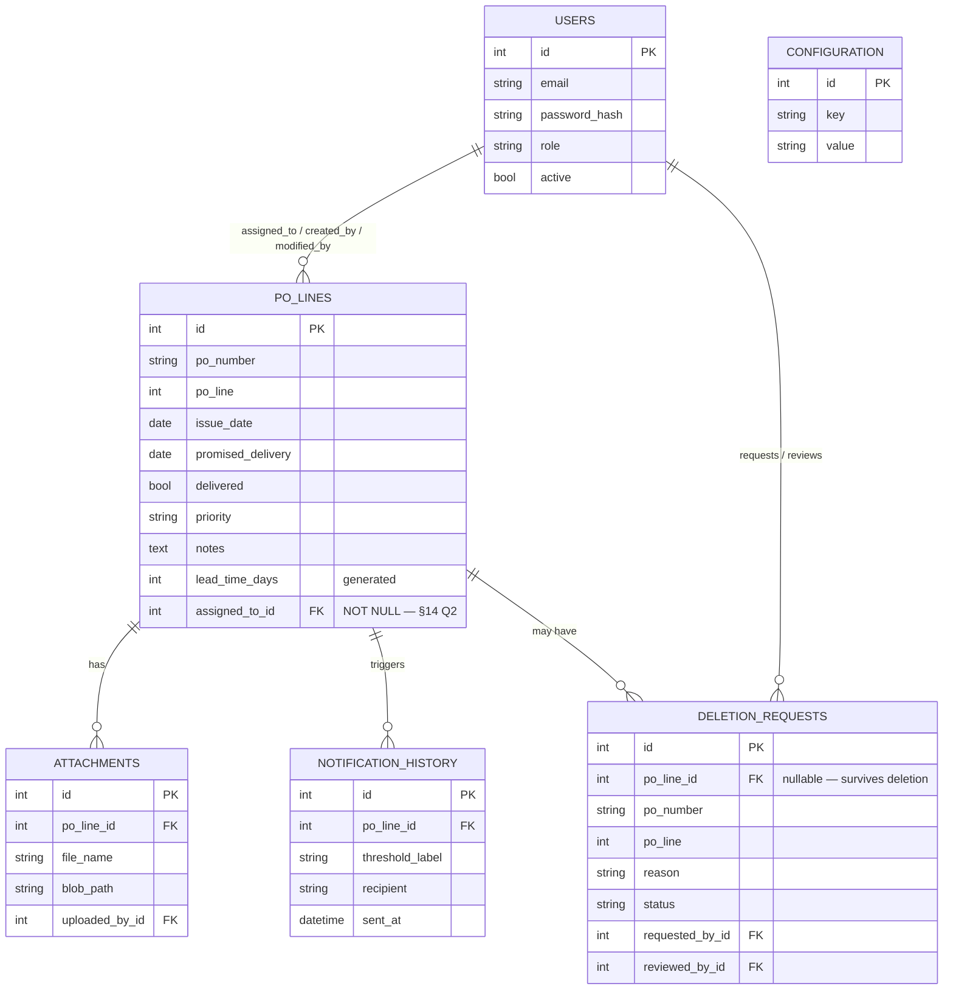

# PO Delivery Tracker — Product Requirements Document

**Version:** 2.1 — Approved
**Status:** Approved by project owner, 31 Aug 2026. Deployment target revised 31 Aug 2026 (§13): Azure → an all-free-tier stack (Vercel + Render + Neon + Cloudflare R2 + Resend/Brevo).
**Supersedes:** the original SharePoint proposal (executive-summary Word doc), and consolidates `SRS.md` + `SYSTEM_DESIGN.md` (v0.1 drafts) with a direct audit of this repository as it stood on 31 Aug 2026.
**Companion wireframes:** https://claude.ai/code/artifact/846dade2-b771-45bc-bbae-1904c6e02f96

> **Read this first if you're picking up implementation work (e.g. in Claude Code):** the status tags below (`[DONE]` / `[PARTIAL]` / `[GAP]` / `[PROPOSED]`) reflect the codebase as of the audit date above. Re-verify against the current tree before trusting a tag — code moves faster than docs.

---

## 1. Executive summary

PO Delivery Tracker replaces the Excel/SharePoint delivery log with a purpose-built web app. It tracks each **PO line** — not each PO — individually, because two items on the same purchase order routinely arrive on different dates. Every line's Lead Time and Days Remaining are computed automatically, and the system is meant to email the right person before a delivery is late, not after.

A working backend (FastAPI + PostgreSQL) and frontend (Next.js) already exist and have been manually tested end-to-end: login, PO line creation and editing, role-based visibility, and a deletion-approval workflow that wasn't in the original design but is a genuine improvement over it — nothing is ever silently deleted without a reason and an administrator's sign-off.

**The alerting system — the actual reason this project exists — is now built (M1, 31 Aug 2026).** A `NotificationSender` abstraction (Mailhog in dev, Resend/Brevo in prod), the daily reminder engine (`backend/app/services/reminders.py`), the de-duplication log, and a secret-guarded `POST /api/v1/internal/run-reminders` endpoint are all in place and unit + integration tested. What remains for it: an external scheduler wired up in production (GitHub Actions workflow is committed but needs a deployed backend and repo secrets — M6), and an admin UI to edit thresholds (M4).

---

## 2. Goals & non-goals

**Goals**
- Replace the Excel/SharePoint tracker with one system of record for PO line delivery status.
- Track every PO line independently — unique key is (PO Number, PO Line), not PO Number alone.
- Compute Lead Time, Days Remaining, and Status automatically; never require a manual update or a daily refresh job.
- Email the assigned person before and after a delivery is due, on thresholds an administrator can change without a code deploy.
- Give managers one dashboard that shows what needs attention today, not just a table to scroll through.
- Keep a full audit trail — who changed or deleted what, when, and why.
- Run identically in local development and in production, so deployment is a configuration change, not a rewrite. Production is a portable, all-free-tier stack (§13) — no dependency on any single cloud provider's proprietary services.

**Non-goals**
- Inventory or stock-level management.
- Vendor performance scoring or supplier scorecards.
- The procurement/ordering process itself — a PO already exists by the time it enters this system.
- Multi-currency handling or financial reconciliation.

---

## 3. Roles & personas

| Role | Can do | Visibility |
|---|---|---|
| Administrator | Everything Manager can, plus manage users/roles and alert thresholds | All PO lines |
| Manager | Create, edit, request deletion of PO lines | All PO lines |
| Staff | Create, edit, request deletion of PO lines | **Assigned lines only** |
| Viewer | Read-only | All PO lines |

**Resolved from SRS Open Question #1:** the codebase now enforces assigned-only visibility for Staff (`backend/app/crud/po_line.py`, `_visible_to`) as the shipped default. Still worth a final confirmation with the employer — see §14.

---

## 4. Build status at a glance

| Area | Status | Note |
|---|---|---|
| Authentication (JWT login) | `[DONE]` | bcrypt password hashing, working end-to-end |
| Role-based access control | `[DONE]` | Enforced server-side on every route |
| PO line create / view / edit | `[DONE]` | Tested through Swagger and the real frontend |
| PO line deletion | `[DONE]` | Via request + Administrator approval, not a direct delete — see §11 |
| Duplicate & date validation | `[DONE]` | Server-side, independent of the UI |
| Lead Time / Days Remaining / Status | `[DONE]` | Computed live — no refresh job |
| Dashboard KPI cards | `[DONE]` | 6 cards, live data |
| Dashboard "needs attention" list / chart | `[GAP]` | Was in the original mockup; only KPI cards were built |
| PO line list — filter / search / sort (UI) | `[PARTIAL]` | API supports `?status=` & `?search=`; no controls in the UI yet |
| Colour-coded urgency (UI) | `[GAP]` | Status shows as plain text today |
| **Email reminders** | `[DONE]` | Reminder engine, `NotificationSender` (Mailhog/Resend/Brevo), dedup log, and `POST /internal/run-reminders` — M1, tested. Production scheduler wiring is M6 |
| Configurable alert thresholds — API | `[DONE]` | `GET/PUT /config/thresholds`, Administrator-only |
| Configurable alert thresholds — admin UI | `[GAP]` | No screen to edit thresholds yet |
| File attachments | `[GAP]` | DB table exists; no upload/download endpoint or UI |
| User management — API | `[DONE]` | Admin-only create/list/update |
| User management — admin UI | `[GAP]` | Backend-only; no screen yet |
| Audit trail (created/modified by + when) | `[DONE]` | Enforced at the ORM layer |
| Deletion audit trail | `[DONE]` | New since the last design pass — see §11 |
| Automated tests / CI | `[GAP]` | No test suite or pipeline found in the repo |
| Cloud deployment / infra | `[GAP]` | `infra/` exists but is empty; target stack is Vercel + Render + Neon + R2 (§13) |
| SSO (Microsoft Entra ID) | `[PROPOSED]` | Designed for, not started |
| Power BI reporting connection | `[PROPOSED]` | Nothing blocks it; not yet configured or tested |

---

## 5. Functional requirements

| ID | Requirement | Status |
|---|---|---|
| FR-1 | One record per PO line, uniquely keyed by (PO Number, PO Line) | `[DONE]` |
| FR-2 | Reject creation of a duplicate (PO Number, PO Line) | `[DONE]` |
| FR-3 | Store Issue Date, Promised Delivery, Delivered flag, Assigned To, Priority, Notes | `[DONE]` — Assigned To is **required** (§14 Q2): validation, `NOT NULL` (migration `0004`), required picker on both forms |
| FR-4 | Support file attachments per PO line | `[GAP]` |
| FR-5 | Automatically compute Lead Time (Promised Delivery − Issue Date) | `[DONE]` |
| FR-6 | Automatically compute Days Remaining and Status in real time, no scheduled refresh | `[DONE]` |
| FR-7 | Authorized users create/edit PO lines through a web form, validated client + server side | `[DONE]` |
| FR-8 | *(new)* Deleting a PO line requires a reason and Administrator approval — never a direct delete | `[DONE]` |
| FR-9 | *(new)* A deletion request's audit record survives even after the PO line itself is deleted | `[DONE]` |
| FR-10 | Send email reminders at configurable day-thresholds before the due date | `[DONE]` — engine picks the single nearest passed threshold per line per run (no burst) |
| FR-11 | Send a due-today alert, then a daily reminder while overdue | `[DONE]` — `due_today` label, then date-stamped `overdue_<date>` once per calendar day |
| FR-12 | Stop all reminders once a line is marked Delivered | `[DONE]` — delivered lines drop out of the pass's query |
| FR-13 | Log every sent reminder (line, threshold, recipient, time) so nothing sends twice | `[DONE]` — `NotificationHistory` write + per-send commit; failed sends are not logged, so they retry |
| FR-14 | Administrator can change alert thresholds without a code change | `[PARTIAL]` — `GET/PUT /config/thresholds` live and honoured by the engine; admin UI is M4 |
| FR-15 | Dashboard KPI counts: Total Open, Due Today, Due This Week, Overdue, Completed, High Priority | `[DONE]` |
| FR-16 | Dashboard surfaces the open lines needing attention, not counts alone | `[GAP]` |
| FR-17 | List view supports filtering by status and searching by PO number | `[PARTIAL]` |
| FR-18 | UI visually colour-codes lines by urgency | `[GAP]` |
| FR-19 | Role-based access enforced server-side on every route | `[DONE]` |
| FR-20 | Staff see only assigned PO lines; other roles see all | `[DONE]` |
| FR-21 | Every write is attributable to a user and a timestamp | `[DONE]` |
| FR-22 | Administrator can manage users and roles | `[PARTIAL]` |
| FR-23 | Authenticate via JWT, with a path to Microsoft Entra ID SSO later | `[PARTIAL]` |
| FR-24 | Database reachable directly by Power BI for reporting | `[PROPOSED]` |

## 6. Non-functional requirements

| ID | Requirement | Status |
|---|---|---|
| NFR-1 | Dashboard loads under 2s with up to 5,000 open PO lines | `[PARTIAL]` — not load-tested; a free-tier backend that has scaled to zero adds a one-time cold-start delay (~1 min) on the first request after idle — see §13 and §14 Q11 |
| NFR-2 | Production deployment targets 99% uptime | `[PROPOSED]` — no prod env yet; free-tier hosts sleep on idle (they wake on request, but the first hit is slow) — 99% *availability* holds, sub-2s *latency* does not without a paid always-on tier |
| NFR-3 | Secrets never committed; prod secrets held in the host's environment-variable store | `[PARTIAL]` — `.env` gitignored locally; Vercel / Render env vars used in prod, no secret manager needed at this scale |
| NFR-4 | Schema normalized for future growth without redesign | `[DONE]` |
| NFR-5 | Automated tests, run in CI on every push | `[GAP]` |
| NFR-6 | Full app runs locally via `docker compose up`, no cloud dependency | `[DONE]` |
| NFR-7 | UI and API both validate input; never rely on UI-only checks | `[DONE]` |
| NFR-8 | Every write attributable to a user + timestamp | `[DONE]` — see FR-21 |

---

## 7. Data model

Six entities. `DeletionRequest` is new since the last design pass.

`days_remaining` and `status` are deliberately **not** stored columns — computed from `promised_delivery` against today's date (Python `hybrid_property` when a record is loaded; a SQL expression when filtering/sorting). That's what makes FR-6 true without a daily refresh job.

---

## 8. API surface

Base path `/api/v1`. Every route except `/auth/login` requires a JWT; role checks happen server-side, never trusted from the client.

| Method | Endpoint | Roles | Status |
|---|---|---|---|
| POST | `/auth/login` | — | live |
| GET | `/po-lines` | any | live |
| GET | `/po-lines/{id}` | any (own, if Staff) | live |
| POST | `/po-lines` | Staff, Manager, Admin | live |
| PUT | `/po-lines/{id}` | Staff, Manager, Admin | live |
| POST | `/po-lines/{id}/deletion-requests` | any (own, if Staff) | live |
| GET | `/deletion-requests` | Administrator | live |
| POST | `/deletion-requests/{id}/approve` | Administrator | live |
| POST | `/deletion-requests/{id}/reject` | Administrator | live |
| GET | `/dashboard/summary` | any | live |
| GET / PUT | `/config/thresholds` | Administrator | live |
| GET / POST / PUT | `/users` | Administrator | live |
| GET | `/users/assignable` | Staff, Manager, Admin | live |
| POST | `/internal/run-reminders` | none (secret `CRON_SECRET` bearer token) | live |
| POST | `/po-lines/{id}/attachments` | Staff, Manager, Admin | **planned** |
| GET | `/po-lines/{id}/attachments/{aid}` | any | **planned** |

---

## 9. Screens & wireframes

See the companion canvas: https://claude.ai/code/artifact/846dade2-b771-45bc-bbae-1904c6e02f96

| Screen | Status | Note |
|---|---|---|
| Login | built | |
| Dashboard | partial | wireframe adds attention list + urgency chart |
| PO Lines list | partial | wireframe adds filters, search, colour-coded status |
| New PO Line | built | now has a required Assigned To picker (§14 Q2) |
| Edit PO Line | built | now has a required Assigned To picker; wireframe adds an attachments panel |
| Request Deletion | built | reason required |
| Admin — Deletion Requests | built | approve/reject with notes |
| Admin — Alert Thresholds | proposed | new screen — closes FR-14 |
| Admin — Users | proposed | new screen — closes FR-22 |

---

## 10. Alert & notification system (build this first — M1)

This is the part of the original request that actually motivated the whole project. Specification:

1. **Trigger.** One protected endpoint — `POST /api/v1/internal/run-reminders` — performs a full pass when called. Nothing schedule-related runs inside the API process, so it works on a host that sleeps or scales to zero. It is invoked once a day by an *external* scheduler: a manual call or local `cron` in dev; a **GitHub Actions scheduled workflow** in production (fallback: cron-job.org). The endpoint requires a secret bearer token (`CRON_SECRET`) supplied by the caller; requests without it are rejected. The same GitHub Actions call also wakes the backend if it has scaled to zero.
2. **Scope.** Loads PO lines where `delivered = false`, oldest promised date first, capped at `REMINDER_BATCH_SIZE` (default 500). A single run must finish inside the backend host's request limit (Render's free tier times out long requests; a self-hosted process has none) and inside the email provider's daily free-tier cap, so the pass also stops after `REMINDER_MAX_EMAILS_PER_RUN` sends (default 90 — under Resend's 100/day). Anything deferred is picked up on the next daily pass.
3. **Thresholds.** Read live from `Configuration` (key `reminder_thresholds_days`, shipped default `30, 60, 90` since migration `0003`; editable via `PUT /config/thresholds`). Standing rules on top of the configured list: always send on the due date itself; while `days_remaining < 0`, send once per calendar day — to the assignee for the first `REMINDER_OVERDUE_ESCALATION_DAYS` days overdue (default 7), then to `REMINDER_ESCALATION_EMAIL` from day N+1 onward (§14 Q3).
4. **One label per line per run.** The engine computes `days_remaining` and picks the *single* most urgent label that applies: `overdue_<date>` if overdue, else `due_today` on the due date, else `<N>_day` for the **nearest already-passed** positive threshold (so a line added inside the 90-day window gets one `90_day` email, not a burst of `90_day` + `60_day` + `30_day`). `0` in the threshold list is treated as "due today" and never produces a `0_day` label.
5. **De-duplication & send.** Check `NotificationHistory` for `(po_line_id, threshold_label)`. If absent, resolve the recipient, send via the `NotificationSender`, then write the `NotificationHistory` row and commit — per send, so a mid-run crash never re-sends. A send that raises is counted as an error and **not** logged, so the next run retries it. Recipient resolution (§14 Q2, Q3): normally the line's active `assigned_to` (now a required field); once a line is more than `REMINDER_OVERDUE_ESCALATION_DAYS` days overdue, `REMINDER_ESCALATION_EMAIL` instead; `REMINDER_FALLBACK_EMAIL` as a safety net for any line still missing an assignee; if none of these resolve, log-and-skip so it retries.
6. **Stop condition.** Once `delivered = true`, the line drops out of the query in step 2 — reminders stop automatically (FR-12).

Email content: subject like *"PO ABC123 - Line 4 is due in 7 days"* (or *is due today* / *is overdue by 3 days*); body includes PO Number, Line, Issue Date, Promised Delivery, Lead Time, Days Remaining, Status, and a direct link to the record.

Dev sends through Mailhog (already wired into `docker-compose.yml`); production sends through **Resend** (3,000/mo ≈ 100/day free) or **Brevo** (300/day free) via their HTTP API, behind a `NotificationSender` interface so the reminder logic doesn't change between environments. A verified sender domain (SPF/DKIM) is required before production email will deliver reliably — see §14 Q4.

### What was built (M1, 31 Aug 2026)

| Piece | Location |
|---|---|
| Decision logic (pure, heavily unit-tested) | `backend/app/services/reminders.py` → `choose_reminder()` |
| Daily pass orchestration | `backend/app/services/reminders.py` → `run_reminders()` |
| `NotificationSender` interface + SMTP/Resend/Brevo impls + factory | `backend/app/services/notifications/` |
| Dedup log data-access | `backend/app/crud/notification_history.py` |
| Secret-guarded endpoint | `POST /api/v1/internal/run-reminders` (`backend/app/api/v1/endpoints/internal.py`) |
| Manual / local-cron runner | `python -m scripts.run_reminders` |
| Production scheduler | `.github/workflows/reminders.yml` (needs repo secrets `BACKEND_BASE_URL`, `CRON_SECRET` — M6) |
| Tests | `backend/tests/test_reminders*.py`, `test_internal_endpoint.py` (37 passing) |

New env vars (see `backend/.env.example`): `CRON_SECRET`, `FRONTEND_BASE_URL`, `EMAIL_BACKEND` (`smtp`/`resend`/`brevo`), `RESEND_API_KEY` / `BREVO_API_KEY`, `SMTP_FROM_NAME`, `REMINDER_FALLBACK_EMAIL`, `REMINDER_OVERDUE_ESCALATION_DAYS`, `REMINDER_ESCALATION_EMAIL`, `REMINDER_BATCH_SIZE`, `REMINDER_MAX_EMAILS_PER_RUN`.

### §14 Q2 / Q3 follow-up — built (31 Aug 2026)

- **Q2 — Assigned To required.** `assigned_to_id` required in `POLineCreate`; `POLineUpdate` may reassign but not clear it. `_validate_assignee` in `crud/po_line.py` rejects unknown/inactive users (→ 400). Migration `0004` backfills existing nulls and sets `NOT NULL`. New endpoint `GET /users/assignable` (Staff/Manager/Admin) feeds a required picker on the New and Edit PO Line forms.
- **Q3 — overdue escalation.** `choose_reminder` takes `overdue_escalation_days` and flags `escalate=True` past the window; `_recipient_for` routes escalated sends to `REMINDER_ESCALATION_EMAIL` (falling through to the assignee if unset). `[ESCALATED]` subject prefix + body note. Run summary gains an `emails_escalated` count.
- Tests: `backend/tests/test_reminders.py`, `test_reminders_run.py::TestOverdueEscalation`, `test_po_line_assignee.py`, `test_users_assignable.py`. Full suite 59 passing; verified end-to-end against Postgres + Mailhog.

---

## 11. Attachments & the deletion workflow

**Attachments (gap).** The `Attachment` table already exists (file name, content type, size, a backend-agnostic `blob_path`, uploader, timestamp) but nothing writes to it yet. Needed: an upload endpoint (multipart), a download endpoint, and an upload control + file list on the PO Line Edit screen. Storage is local disk in dev, **Cloudflare R2** (10 GB free, no egress fees) in production, behind an S3-compatible client so the two are interchangeable. Uploads stream straight to the object store — a serverless/free-tier backend has a read-only or ephemeral filesystem. File type/size limits are an open question — see §14.

**Deletion workflow (built, new since the last design pass).** The original design assumed a Manager could delete a PO line outright. The shipped system does not allow that: any user who can see a line can submit a deletion request with a required reason; only an Administrator can approve or reject it. Approving deletes the PO line but the request record survives (`po_line_id` goes null, a permanent snapshot of the PO number/line stays behind) — so there's always a durable answer to "who deleted this, and why."

---

## 12. Security & audit

- Passwords hashed with `bcrypt` directly (the earlier `passlib` dependency was dropped after a real compatibility break with modern bcrypt).
- JWTs carry `sub` (user id), `role`, and `exp`; every protected route re-validates the token and the user's active status.
- Role checks live in one FastAPI dependency (`require_roles(...)`), not scattered through business logic.
- Every PO line write carries `created_by` / `modified_by` / timestamps, set from the authenticated session — never accepted from client input.
- CORS restricted to the frontend's own origin.
- `/internal/run-reminders` is the one route with no user session: it is guarded by a constant-time comparison against the `CRON_SECRET` bearer token, rejects anything else with 401, and is excluded from CORS. The token lives only in the backend host and the GitHub Actions secret store.
- `.env` is gitignored; nothing secret has been committed.

---

## 13. Architecture & environments

The production target is an **all-free-tier stack**, chosen so the project costs nothing to run and stays portable (every piece is standard Postgres / S3 / SMTP-style HTTP, swappable for a paid equivalent later without code changes).

| Concern | Local (today) | Production (target) | Free-tier limit that matters |
|---|---|---|---|
| Frontend hosting | `next dev` | **Vercel** (Hobby) | 100 GB bandwidth/mo; **non-commercial use only** — see §14 Q10 |
| Backend hosting | Uvicorn in Docker | **Render** (free web service) | 512 MB / 0.1 CPU, sleeps after ~15 min idle (~1 min cold start), ~100s request cap |
| Database | Postgres in Docker | **Neon** (free) | 0.5 GB storage, 100 compute-hrs/mo, scale-to-zero; use the **pooled** connection string |
| File storage | Local volume | **Cloudflare R2** (free) | 10 GB storage, 1M writes/mo, no egress fees |
| Email | Mailhog | **Resend** or **Brevo** (free) | Resend ~100/day, Brevo 300/day; verified sender domain required |
| Secrets | `.env` file | Vercel + Render environment variables | no secret manager at this scale |
| Scheduler | manual call / local `cron` → `/internal/run-reminders` | **GitHub Actions** scheduled workflow → same endpoint (fallback: cron-job.org) | GitHub Actions cron: free, ~5–15 min timing jitter, UTC |

`infra/` is currently an empty folder — nothing has been provisioned yet (milestone M6). What little "infra" this stack needs is a GitHub Actions workflow file, a `vercel.json`, and a Render service definition — all committed to the repo, no separate IaC tool required.

**Known tradeoff of going fully free:** the Render backend sleeps when idle, so the first request after a quiet period (including the daily reminder run, and a user opening the dashboard first thing in the morning) waits ~1 minute while it wakes. If that proves unacceptable, the smallest fix is Render's paid always-on instance (~$7/mo) or Fly.io pay-as-you-go (~$2–5/mo) — no other change. Tracked as §14 Q11.

---

## 14. Open questions for decision

1. Staff currently see only PO lines assigned to them — correct default, or should Staff see everything?
2. ~~Who receives the reminder email for a PO line with no Assigned To set?~~ **DECIDED & BUILT (31 Aug 2026): both.** Assigned To is now a **required** field: Pydantic validation on create/edit (unknown/inactive user → 400; explicit `null` on edit → 422), `po_lines.assigned_to_id` is `NOT NULL` (migration `0004`, existing nulls backfilled to the lowest-id user), and the New/Edit forms have a required assignee picker fed by `GET /users/assignable`. `REMINDER_FALLBACK_EMAIL` is kept as a safety net for a line whose assignee is later deactivated; if nothing resolves, the engine logs and skips (retry next run).
3. ~~Should overdue reminders repeat daily indefinitely?~~ **DECIDED & BUILT (31 Aug 2026): daily for N days, then escalate.** While overdue, the assignee gets one reminder per calendar day for the first `REMINDER_OVERDUE_ESCALATION_DAYS` days (default 7). Once more than N days overdue, the daily reminder goes to `REMINDER_ESCALATION_EMAIL` instead, subject-prefixed `[ESCALATED]` and noting who the assignee is; if that address isn't configured it falls back to the assignee so nothing is lost. The `overdue_<date>` de-dupe label is unchanged, so it's still at most one send per day regardless of recipient. Reminders stop entirely once the line is Delivered.
4. Any branding requirements for the UI or the email templates?
5. Is Microsoft Entra ID SSO required for launch, or can it follow the initial JWT-based release?
6. What attachment file types and maximum size should be allowed?
7. Is a mobile-responsive layout required for v1, or is desktop-only acceptable initially?
8. Any existing vendor or business-unit data that should be modeled now rather than retrofitted later?
9. When a deletion request is approved, should the PO line be hard-deleted, or soft-deleted/archived so reporting history stays intact?
10. Vercel's Hobby (free) plan is licensed for **non-commercial use only**. This is an employer tool. Accept the risk for a pilot, budget for Vercel Pro ($20/mo) at launch, or host the frontend on Cloudflare Pages / Netlify instead (both allow commercial use on their free tiers, both run Next.js)?
11. Is a ~1-minute cold-start delay on the first request after an idle period acceptable, or should the backend go straight to a paid always-on tier (~$2–7/mo)?

---

## 15. Roadmap

- **M1 — Notifications — DONE (31 Aug 2026).** Reminder engine, `NotificationSender` (Mailhog/Resend/Brevo), dedup log, and the `POST /internal/run-reminders` endpoint per §10, with unit + integration tests. Closes FR-10, FR-11, FR-12, FR-13; FR-14 is API-complete (admin UI in M4). The §14 Q2/Q3 follow-ups (Assigned To required; overdue escalation) are also built — see §10. Remaining for M1: wire the committed GitHub Actions workflow to a deployed backend (M6).
- **M2 — Dashboard & list UI.** Attention list + urgency chart on the dashboard; filters, search, and colour-coding on the PO Lines list. Closes FR-16 through FR-18.
- **M3 — Attachments.** Upload/download API and an attachments panel on the Edit screen. Closes FR-4.
- **M4 — Admin screens.** Alert-threshold config screen and user-management screen. Closes FR-14 and FR-22 in full.
- **M5 — Hardening.** Automated test suite and a CI pipeline running it on every push. Closes NFR-5.
- **M6 — Production deployment (free-tier stack).** Create the Neon database, Cloudflare R2 bucket, and Resend/Brevo sender; deploy the frontend to Vercel and the backend to Render with env vars set in each dashboard; add the GitHub Actions workflow that calls `/internal/run-reminders` daily. Resolves §14 Q10–Q11 first.
- **M7 — stretch.** SSO, Power BI, mobile — pending answers to §14.

---

## 16. Approval

**Status: Approved by project owner, 31 Aug 2026.** Implementation proceeds milestone by milestone starting with M1.

---

*Sources: original SharePoint proposal (ChatGPT, 20 Jul 2026) · `docs/SRS.md` & `docs/SYSTEM_DESIGN.md` (v0.1 drafts) · build/debugging session (Claude, 20–27 Jul 2026) · direct audit of this repository on 31 Aug 2026.*
