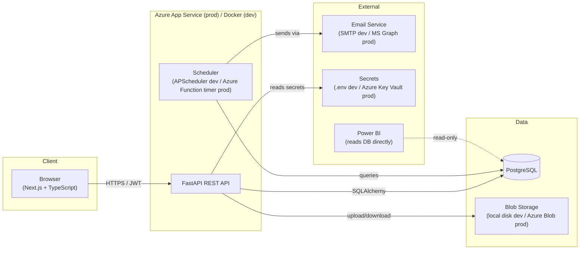
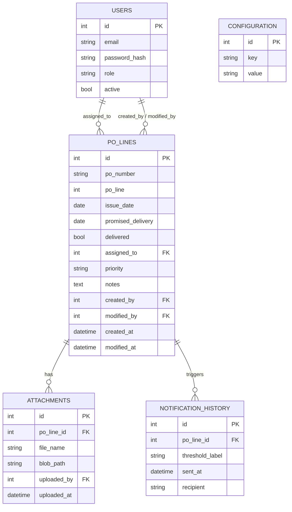
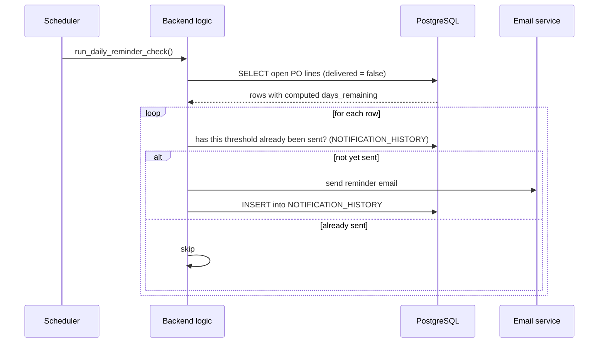
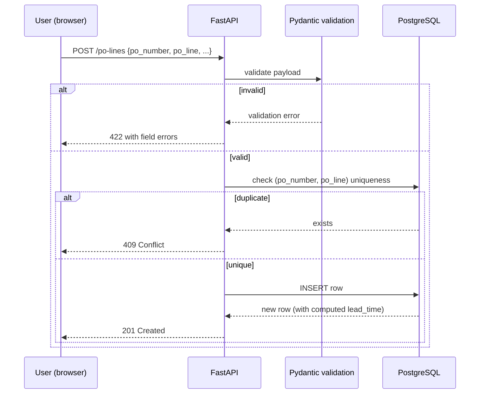
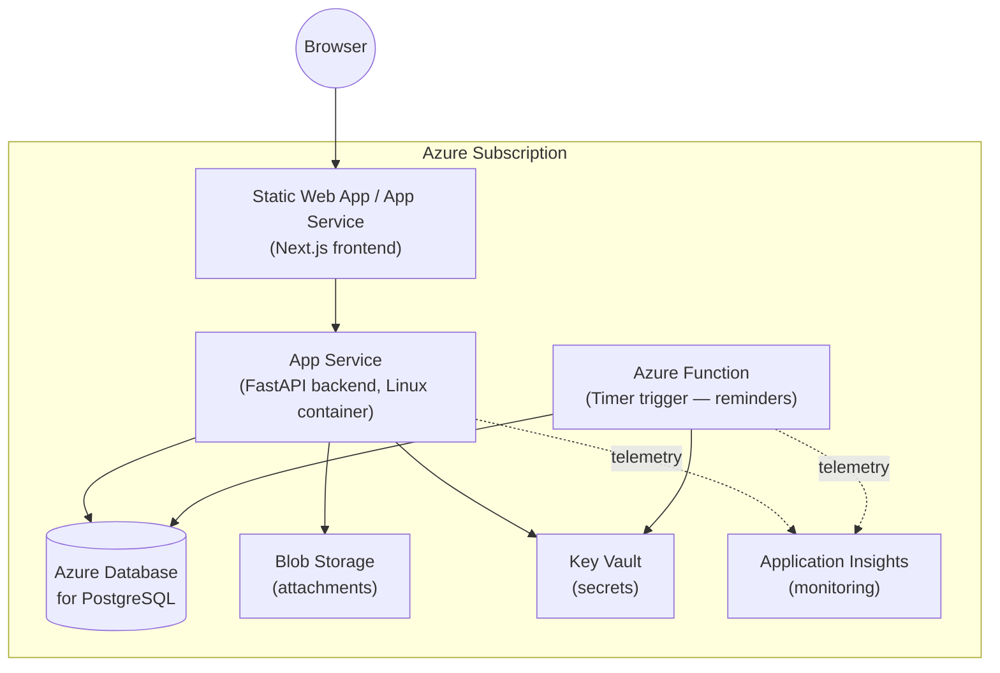

# System Design Document
## PO Delivery Tracking System

**Version:** 0.1 (Draft)
**Depends on:** `SRS.md` (Phase 1)
**Status:** For review before backend work starts

---

## 1. Architecture Overview

Three-tier architecture: a Next.js frontend, a FastAPI backend exposing a REST API, and a PostgreSQL database. Everything runs locally via Docker Compose during development; the same containers deploy to Azure later with no code changes — only configuration (connection strings, secrets) changes between environments.

## 2. Component Responsibilities

| Component | Responsibility | Dev implementation | Prod implementation |
|---|---|---|---|
| Frontend | Dashboard, forms, auth UI | Next.js dev server | Azure Static Web Apps or App Service |
| Backend API | Business logic, validation, auth enforcement | FastAPI in Docker | Azure App Service (Linux container) |
| Database | System of record | PostgreSQL in Docker | Azure Database for PostgreSQL |
| Scheduler | Daily reminder checks | APScheduler inside the API process | Azure Function (Timer trigger) — decoupled so this swap doesn't touch business logic |
| File storage | Attachments (invoices, receipts) | Local disk volume | Azure Blob Storage |
| Email | Reminder delivery | SMTP (e.g. Mailhog for local testing) | Microsoft Graph API (send-as a real O365 mailbox) or SendGrid |
| Secrets | DB password, API keys | `.env` file (gitignored) | Azure Key Vault, injected as App Service settings |
| Reporting | Analytics, trends | — | Power BI connects directly to PostgreSQL |

The email service and scheduler are both written behind a small interface (`NotificationSender`, `JobScheduler`) so that swapping the dev implementation for the Azure one later is a config change, not a rewrite — this satisfies NFR-6 from the SRS.

---

## 3. API Design

Base path: `/api/v1`. All endpoints except `/auth/login` require a valid JWT in the `Authorization: Bearer` header. Role checks happen in the API layer, never trusted from the client.

| Method | Endpoint | Roles | Purpose |
|---|---|---|---|
| POST | `/auth/login` | — | Exchange credentials for a JWT |
| GET | `/auth/me` | any authenticated | Return current user + role |
| GET | `/po-lines` | any authenticated | List PO lines; supports `?status=`, `?assigned_to=`, `?search=` |
| GET | `/po-lines/{id}` | any authenticated | Get one PO line, including attachments and history |
| POST | `/po-lines` | Staff, Manager | Create a PO line |
| PUT | `/po-lines/{id}` | Staff, Manager | Update a PO line |
| DELETE | `/po-lines/{id}` | Manager | Delete a PO line |
| POST | `/po-lines/{id}/attachments` | Staff, Manager | Upload a file |
| GET | `/po-lines/{id}/attachments/{attachment_id}` | any authenticated | Download a file |
| GET | `/dashboard/summary` | any authenticated | KPI counts for the dashboard cards |
| GET | `/config/thresholds` | Administrator | Get current reminder thresholds |
| PUT | `/config/thresholds` | Administrator | Update reminder thresholds |
| GET | `/users` | Administrator | List users and roles |
| POST | `/users` | Administrator | Create a user |
| PUT | `/users/{id}` | Administrator | Update role/status |

FastAPI generates interactive Swagger docs (`/docs`) automatically from these route definitions — that becomes the living API reference, no separate document to maintain by hand.

---

## 4. Database Design (Overview)

Full schema and migrations are Phase 3. This is the entity-level shape.

`NOTIFICATION_HISTORY` is new versus the original SharePoint design — it didn't have a clean way to log "which reminder was already sent for this item," which meant relying on flow-run history. Logging it directly means the daily job can query "has a 7-day reminder already gone out for this line?" instead of re-deriving it, and it gives Administrators a real audit trail of what was sent and to whom.

---

## 5. Key Flows

### 5.1 Daily reminder check

### 5.2 Create a PO line

---

## 6. Authentication & Authorization

- **Dev:** username/password → JWT (short-lived access token). Password hashing via `bcrypt`.
- **Prod path:** same JWT-based flow stays available; Microsoft Entra ID SSO can be added as a second login option later (organizations often want both a service account login and SSO) without changing how the rest of the API checks roles, since role information is normalized in the `users` table either way.
- **Authorization:** every protected route depends on a FastAPI dependency (`require_role(["Manager", "Administrator"])`) — role checks live in one place, not scattered through business logic.
- **Row-level visibility** (e.g., "Staff only sees their assigned lines") is an open question from the SRS (Open Question #1) — if required, it's enforced as a `WHERE assigned_to = current_user.id` filter added at the query layer for the Staff role only.

## 7. File Storage

- **Dev:** files saved to a local `./uploads` volume, path stored in `attachments.blob_path`.
- **Prod:** same code path, but the storage backend is swapped for Azure Blob Storage via an abstraction (`StorageBackend.save(file) -> path`). The database only ever stores a path/URL reference, never the file itself, so this swap doesn't touch schema or business logic.

## 8. Notifications

- Reminder content mirrors Section 7 of the original design document (subject/body format, dynamic fields, direct link back to the record).
- Threshold values (30/14/7/3/1/0 days + daily overdue) are stored in the `CONFIGURATION` table, editable via `/config/thresholds`, satisfying FR-9.

## 9. Background Jobs

- **Dev:** `APScheduler` running inside the FastAPI process on a daily cron-style trigger — simplest possible setup, no extra infrastructure.
- **Prod option:** if load or reliability requirements grow, the same job logic moves to an Azure Function (Timer trigger) unchanged, since the reminder logic lives in a plain Python function decoupled from *how* it gets triggered.

## 10. Security Considerations

- Secrets never committed to source control (`.env` is gitignored from day one).
- All input validated server-side via Pydantic, regardless of what the frontend already checked (NFR-7).
- Passwords hashed, never stored or logged in plaintext.
- File uploads restricted by type/size at the API layer before being written to storage.
- Audit trail (`created_by`/`modified_by`/timestamps`) is enforced at the ORM layer, not left to the client to set.

## 11. Deployment Diagram (Target Production State)

This is the Phase 12 target — noted here for context, but not built until the backend and frontend are working locally first.

## 12. Local vs. Production Configuration

| Concern | Local (Docker Compose) | Production (Azure) |
|---|---|---|
| Database | Postgres container | Azure Database for PostgreSQL |
| File storage | Local volume | Azure Blob Storage |
| Email | Mailhog (catches mail, no real sending) | Microsoft Graph or SendGrid |
| Secrets | `.env` file | Azure Key Vault |
| Scheduler | In-process APScheduler | Azure Function Timer trigger |
| Monitoring | Console logs | Application Insights |

---

## 13. Open Design Decisions

1. Should attachment file size/type be restricted (e.g. PDFs and images only, 10MB max)?
2. Does "Staff sees only assigned lines" (SRS Open Question #1) get built into v1, or added later as a filter toggle?
3. Is a mobile-responsive layout required for v1, or desktop-only acceptable initially?
4. Do we need soft-delete (keep deleted PO lines for audit) instead of hard delete for Manager-initiated deletes?

---

Next: **Phase 3 — Database Design** turns Section 4 above into the actual SQLAlchemy models, Alembic migration, and indexes.
